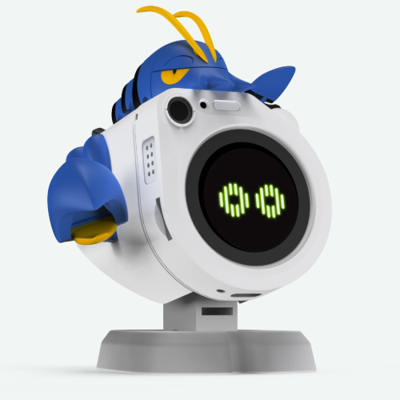

<h1 align="center">WatcherRobot: 桌面级 OpenClaw 语音交互机器人</h1>

<div align="center">

> 基于 SenseCAP Watcher 的桌面级 OpenClaw 语音交互机器人

[](LICENSE)
[]()
[]()

<p align="center">
  
</p>

## 目录

- [项目简介](#项目简介)
- [功能特点](#功能特点)
- [目录结构](#目录结构)
- [快速开始](#快速开始)
  - [Firmware（嵌入式固件）](#firmware嵌入式固件)
  - [WatcherServer（PC端语音服务）](#watcherserverpc端语音服务)
  - [WatcheRobotAPP（手机上位机）](#watcherrobotapp手机上位机)
  - [Hardware（硬件设计）](#hardware硬件设计)
- [技术栈](#技术栈)
- [贡献指南](#贡献指南)
- [许可证](#许可证)
- [常见问题](#常见问题)

---

## 项目简介

WatcherRobot 是一个开源的桌面级 OpenClaw 语音交互平台，旨在为教育和研究提供一个可扩展的语音交互平台。项目基于 SenseCAP Watcher 模块实现核心控制功能，通过 OpenClaw 系统实现语音交互。

### 目标用户

- 机器人爱好者
- 嵌入式开发学习者
- 教育机构
- 研究人员

---

## 功能特点

- 🎙️ **语音控制** - 通过 OpenClaw 实现语音指令交互
- 📱 **手机 APP** - React Native 开发的跨平台移动应用
- 🖥️ **PC 服务端** - 提供 OpenClaw 语音服务的后端支持
- 🔧 **模块化设计** - 固件、硬件、软件分离，便于二次开发
- 🛠️ **可扩展性** - 支持功能扩展和自定义开发

---

## 目录结构

```
Watcher/
├── Firmware/               # 嵌入式固件代码
│   ├── MVP-W/             # MVP-W 固件 (v1.5.0)
│   │   ├── firmware/
│   │   │   ├── s3/       # ESP32-S3 主控固件
│   │   │   └── mcu/      # ESP32 MCU 舵机控制
│   │   ├── releases/     # 预编译固件
│   │   ├── docs/         # 固件开发文档
│   │   ├── server/       # Python 边缘服务器
│   │   └── README.md     # 固件说明
│   └── CLAUDE.md        # 固件开发指南
│
├── WatcherServer/         # PC端语音服务
│   ├── src/               # 源代码
│   ├── docs/              # 开发文档
│   ├── tests/             # 测试用例
│   ├── config/            # 配置文件
│   ├── main.py            # 入口文件
│   └── README.md          # 服务端说明
│
├── WatcheRobotAPP/        # 手机上位机 (React Native)
│   ├── src/               # 源代码
│   ├── ios/               # iOS 项目
│   ├── android/           # Android 项目
│   ├── docs/              # APP 文档
│   └── README.md          # APP 说明
│
├── Hardware/              # 硬件设计（PCB、结构）
│   ├── PCB.pcbdoc/schdoc # PCB 设计文件
│   ├── Gerber/           # PCB 制造文件
│   ├── BOM/              # 物料清单
│   ├── RobotModel/       # 3D 结构模型
│   └── Assets/           # 设计素材
│
├── Design/                # 设计文件
│   └── (待添加)
│
├── LICENSE                # GNU GPL v3 许可证
├── CONTRIBUTING.md        # 贡献指南
├── CODE_OF_CONDUCT.md    # 行为准则
└── README.md             # 项目总览
```

---

## 快速开始

### Firmware（嵌入式固件）

Firmware 目录包含 MVP-W（最小可行产品）固件，采用双芯片架构：ESP32-S3 作为主控制器，ESP32 MCU 用于舵机控制。

**系统功能：**
- 端到端语音交互（按键触发 → ASR → LLM → TTS）
- ESP-SR 离线唤醒词检测 ("Hi 乐鑫")
- VAD 静音自动停止
- PNG 动画显示（24帧表情）
- WebSocket 双向通信
- UDP 服务发现
- 双轴舵机云台控制（MCU + BLE）

**硬件要求：**
- **S3 主控**：ESP32-S3 (16MB Flash + 8MB PSRAM)
- **MCU 舵机**：ESP32 (4MB Flash)
- **麦克风**：I2S DMIC，16kHz 采样
- **扬声器**：I2S，24kHz 播放
- **舵机**：PWM × 2（X轴：GPIO 12，Y轴：GPIO 15）

**构建步骤：**

```bash
# S3 主控固件
cd Firmware/MVP-W/firmware/s3
idf.py set-target esp32s3
idf.py build

# MCU 舵机固件
cd Firmware/MVP-W/firmware/mcu
idf.py set-target esp32
idf.py build
```

详细固件说明和烧录步骤请参考 [Firmware/MVP-W/README.md](Firmware/MVP-W/README.md)

---

### WatcherServer（PC端语音服务）

WatcherServer 提供基于 OpenClaw 的语音服务，处理语音识别（ASR）和语音合成（TTS）。

**前置要求：**
- Python 3.8+
- Conda 或 venv 环境

**快速启动：**

```bash
# 1. 创建并激活环境
conda env create -f environment.yml
conda activate watcher

# 2. 复制配置
cp .env.example .env
# 编辑 .env 文件，配置必要的 API 密钥

# 3. 启动服务
python main.py
```

详细说明请参考 [WatcherServer/README.md](WatcherServer/README.md) 或 [WatcherServer/README_CN.md](WatcherServer/README_CN.md)

---

### WatcheRobotAPP（手机上位机）

基于 React Native 开发的跨平台移动应用，用于控制机器人并与 OpenClaw 语音服务交互。

**前置要求：**
- Node.js 18+
- Yarn 或 npm
- React Native CLI
- Xcode（iOS 开发）
- Android Studio（Android 开发）

**安装步骤：**

```bash
cd WatcheRobotAPP

# 安装依赖
yarn install

# 运行 iOS
yarn ios

# 运行 Android
yarn android
```

详细说明请参考 [WatcheRobotAPP/README.md](WatcheRobotAPP/README.md)

---

### Hardware（硬件设计）

Hardware 目录用于存放 PCB 设计和 3D 结构模型文件。

**目录结构：**

```
Hardware/
├── PCB.pcbdoc           # PCB 设计文件 (Altium Designer)
├── PCB.schdoc           # PCB 原理图文件
├── Schematic_PDF.pdf    # 原理图 PDF 版本
├── README.md            # 硬件设计说明
├── Assets/              # 设计素材
│   ├── render.png       # 渲染图
│   ├── render.gif       # 渲染动图
│   └── WatcheRobot.PNG  # 展示图
├── Gerber/              # PCB 制造文件 (Gerber)
├── BOM/                 # 物料清单
│   └── BOM.xls          # 物料清单 Excel
└── RobotModel/          # 3D 模型文件 (STEP/STL)
    ├── 机身.stl             # 机身 3D 模型
    ├── 机身加灯带.stl       # 带灯带版本
    ├── 底座.step            # 底座
    ├── 支架前盖.step        # 支架前盖
    ├── 支架后壳.step        # 支架后壳
    ├── MG90S Assembly SERVO-_.step  # 舵机模型
    ├── 3D_PCB1_Layout.step          # PCB 3D 模型
    └── ...
```

**主要组件：**

- 主控：ESP32-S3
- 舵机：MG90S × 3（可选用于运动控制）
- 传感器：扩展 IO、环境传感器接口

详细说明请参考 [Hardware/README.md](Hardware/README.md)

---

## 技术栈

| 模块 | 技术栈 |
|------|--------|
| 嵌入式固件 | ESP-IDF, ESP32-S3, ESP32 (MCU), FreeRTOS, LVGL, ESP-SR |
| PC服务端 | Python, WebSocket, ASR (阿里云), LLM (Claude API), TTS (火山引擎) |
| 手机APP | React Native, TypeScript |
| 硬件 | Altium Designer (PCB), Fusion 360 (3D) |

---

## 贡献指南

欢迎为 WatcherRobot 项目贡献代码！请阅读我们的 [贡献指南](CONTRIBUTING.md) 了解如何参与开发。

### 提交问题

- 在提交 Issue 前，请先搜索是否已有类似问题
- Issue 应包含清晰的问题描述和复现步骤
- 对于功能请求，请说明使用场景和预期效果

### 提交代码

1. Fork 本仓库
2. 创建特性分支 (`git checkout -b feature/amazing-feature`)
3. 提交更改 (`git commit -m 'Add some amazing feature'`)
4. 推送分支 (`git push origin feature/amazing-feature`)
5. 开启 Pull Request

---

## 许可证

本项目基于 **GNU General Public License v3.0** 开源协议。

查看 [LICENSE](LICENSE) 文件了解详细信息。

## 常见问题

### Q: 支持哪些开发板？

A: 目前主要支持 ESP32-S3 系列开发板，其他 ESP32 型号正在适配中。

### Q: 如何获取语音 API 密钥？

A: 请查阅 [WatcherServer/DEVELOPMENT.md](WatcherServer/DEVELOPMENT.md) 了解支持的 ASR/TTS 服务配置方法。

### Q: 可以使用其他语音助手吗？

A: 可以，WatcherServer 采用模块化设计，可以根据文档添加新的语音服务支持。

### Q: 硬件设计文件在哪里？

A: 硬件设计文件已发布在 Hardware 目录，包括：
- PCB 设计文件（Altium Designer 格式）
- Gerber 制造文件
- 3D 结构模型（STEP/STL 格式）
- BOM 物料清单

详细说明请参考 [Hardware/README.md](Hardware/README.md)

---

## 联系方式

- 问题反馈：[GitHub Issues](https://github.com/Ro-In-AI/WatcheRobot/issues)
- 讨论交流：[GitHub Discussions](https://github.com/Ro-In-AI/WatcheRobot/discussions)

---

<div align="center">
**感谢您的关注和支持！** ⭐

如果本项目对您有帮助，请给个 Star 吧！

</div>
